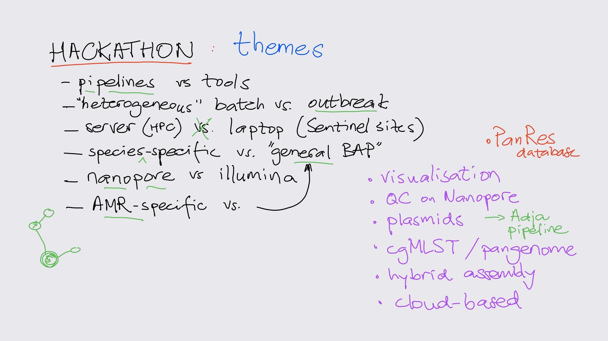
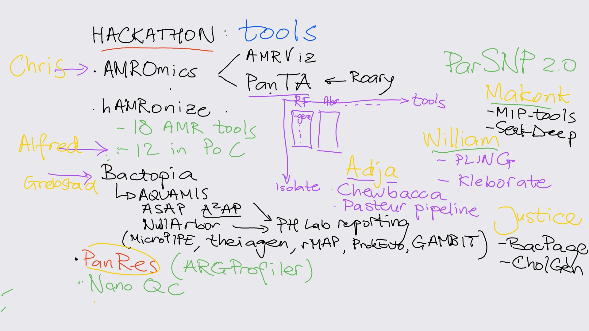

# hackathon-nmimr-2024

This repo shares results from the hackathon at @Noguchi Aug 2024.

The idea of the Hackathon was to try and implement (over the course of three
days) a number of bioinformatics tools relevant to the SeqAfrica project.

## Themes & Tools

The themes underlying the choices of tools were:

The selection of tools is summarised on this whiteboard:

## Contents

In [this repo](https://github.com/seqafrica/hackathon-nmimr-2024):

 * [Kleborate](Kleborate): installation of Kleborate (@wboateng72)
 * [slurm-demo](slurm-demo/README.md): basic Slurm usage (@zwets)

In other [SeqAfrica repos](https://github.com/seqafrica):

 * [AMRViz](https://github.com/seqafrica/AMRViz): installation of AMROmics & AMRViz (@Reiychris)
 * [bacpage_nmimr](https://github.com/seqafrica/bacpage_nmimr): installation of BacPage (@iamamofa)

Other demos:

 * **Bactopia** (@kGrebs)
 * **Chewbacca** and **IPD pipeline** (@AdjaBoussoGueye)
 * **hAMRonize** (Alfred)
 * **MIPtools** and **SeekDeep** (Makonk)

## Open End & Follow-up

 * AMRomics error running Chris's samples
 * hAMRonize check ResFinder output (6 gene limit?)
 * Slurm open ends:
   - Simpler "horizontal batching" (iterate over inputs)
   - Workflow support in Slurm ("vertical batching")
   - Container support

